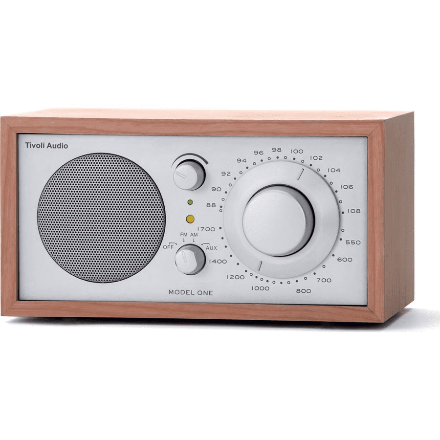
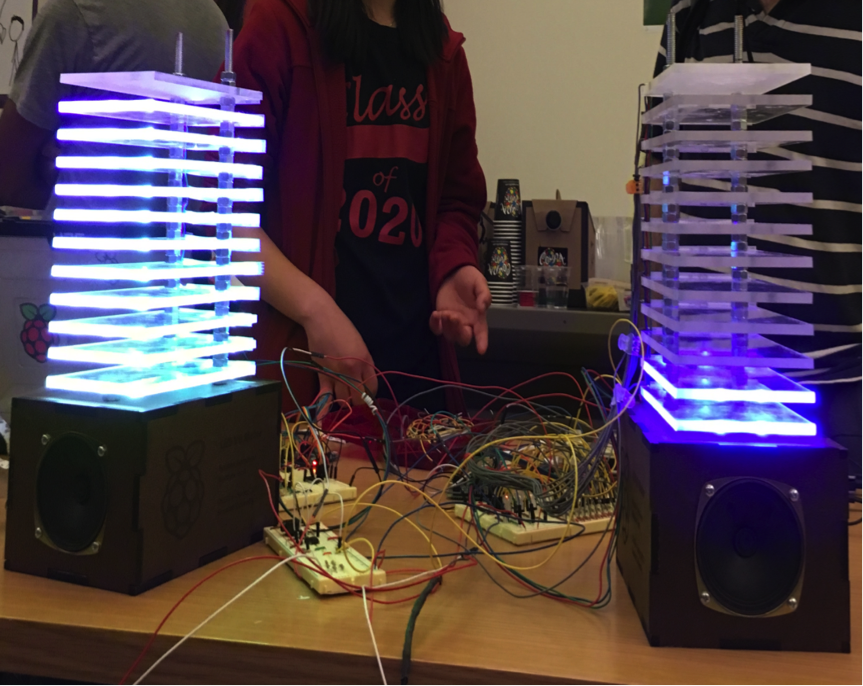

## Motivation for the UberRadio
Some years back, I bought an AM /FM table top radio that was visually attractive and had exceptional sound quality, called the Tivoli Audio Model One. Although it was a bit expensive, it was a treasure! I loved to listen to it! It could fill a room with sound, was easy to operate, and was popular with the entire family. It looks like this –

After we moved I found that, at my new home, I did not get good reception with any of my AM / FM radios. Even the Model One with its excellent tuner didn’t work very well. Alas, no more free good music for me!

Times changed and I got an invitation to try Spotify (it was invitation only in those days!). This was great! I could now stream music but now I had to use my computer as a stereo. The sound wasn’t as good and it was cumbersome clicking through the ads. (I should also state the obvious: I’m too cheap to pay for  music unless it is a live performance.)

Occasionally, I still use my computer to listen to music while I work. At home, I now listen to music stored on a laptop and played through an actual “stereo” via the AUX input jack. That sounds much better than the computer and I don’t have to deal with ads. 

So the crux is this -
**I have wanted a box like the Model One that can play music throughout my home or office. I want to be able to play songs off my computer, off my cell phone, off the Internet, and, yes, even off the air!**

More recently, Matthew Trost shared a project he has been working on. He calls it “LED Towers”. Several other students are building them along with Matthew. The project looks like this (two shown) – 

These have speakers in the base and multi-color LEDs arranged such that they illuminate the different pieces of acrylic in response to the sound. Matthew has made good progress in packaging the project (version 2.0 not shown) but it doesn’t include an amplifier to drive the speaker so the sound could be louder.

In another twist of fate, Prof. Simon Wong decided that for one of the Electrical Engineering class labs (101B) folks would build a Class D amplifier. He, of course, did more than just build the amplifier portion; he made it Bluetooth enabled! He demonstrated how loud it was by streaming Taylor Swift music in my office. Very Impressive!! I mean the device, I’m not a Taylor Swift fan.

I interpret all this goodness happening as a call to ACTION! For this workshop we’re going to MAKE the **UR** (uber-radio).

### Where should we start?
Before we move forward with this, I need to make a disclaimer-

**DISCLAIMER -** 
*I HAVE VERY FEW **ORIGINAL** IDEAS. IF YOU SEE SOMTHING HERE THAT LOOKS ORIGINAL, IT PROBABLY ISN'T! 
I WILL TRY TO PROVIDE PROPER ATTRIBUTION WHENEVER POSSIBLE, BUT I PROBABLY WON'T GET EVRYTHING CORRECT. IF YOU SEE SOMETHING THAT IS YOUR ORIGINAL IDEA, PLEASE LET ME KNOW SO I CAN GIVE YOU CREDIT!* 

OK, then, there are a couple of ways to approach this, but one of the first things we'll need is a sort of map of where everything fits. This type of diagram is called a "**block diagram**" and it will allow us to see how the various functions interact. In addition, this representation allows us to focus on the **interfaces** between blocks (and blocks and the external world). This will prove to be a powerful way to understand what each block does and what it needs to function. The first "bare bones" version of the block diagram may be seen here -

We could use basically any graphics program to create a block digram, but since we are learning KiCAD, I have chosen to us that and create the block diagram as a heirarchical first schematic page. This will allow us to use **global labels** to connect the blocks and make it easier to keep things straight. This is not so difficult for something as simple as the UberRadio, but for more complicated systems this can be a real help!

### The SAM32 Block

Looking at the blocks, we see that there is a block marked "**MCU / WiFi / BLE**" with another label "**SAM32 Board**". Good news for us, Mr. Max Holliday has designed, built and been hard at work coding and debugging this block! You can find a TON of information about this board on his Github here [**SAM32**](https://github.com/maholli/SAM32). Here is what it looks like -  
I **strongly** encourage you to spend some *quality time* with this block because it is a marvel of modern engineering! You may never need another board again!! 
PLEASE THANK MAX FOR ALL HIS TIME AND EFFORT BUILDING THIS!! 
Also don't forget, if you can code, you can contribute! Visit https://github.com/maholli/SAM32/projects/1 for a current list of software tasks that you can help with!

### The Audio Board Block

As nice as the SAM32 is, it isn't designed to drive speakers (*why would it be?*). This means we need somthing that will provide enough power to drive some speakers and make some noise! So, you ask, what *exactly* does come out of the SAM32? And how do we turn that into sound?

Well, the answer is "I'm not just sure yet. But I'll know in a couple of hours." I suspect that we will find some sort of PCM or I2S output available if we code things correctly. 

If you want to follow along, you should check out these videos: 

a shorter video  - [ESP32 Internet Radio by Vergil Cola](https://www.youtube.com/watch?v=Bk9KnJSv3vg) 

a video by a Swiss guy - [#195 DIY Internet Radio using an ESP32 (Arduino IDE)](https://www.youtube.com/watch?v=hz65vfvbXMs&t=7s)

here is a link to the [Edzelf/ESP32-Radio](https://github.com/Edzelf/ESP32-Radio)

OK, so the Swiss guy, Andreas Spiess, made his with a VS1053 chip. If we look into this a bit, we find that there is a later chip with very similar but additional capabilities, the [VS1063](www.vlsi.fi/en/products/vs1063.html) also from VLSI. This seems promising! So maybe we can just connect the SAM32 to a VS1063 to produce audio output!?!?

Looking at the prices on the VLSI Web Store, it seems that the VS1053 is about half the price of the VS1063. Is it worth the price difference? More to think about...

But wait! We still need something to drive the speaker(s)! This is where Professor Wong's Class D amplifer comes in. We can probably just connect the audio output from the VS10x3 codec to the input of the amplifier section. Hmmm... 

This looks promising! Here are a couple of parts from Texas Instruments that might work well: 

the [TPA3250 70W Stereo / 130W Peak Ultra-HD, Analog-In, Pad-Down Calss-D Amplifier](http://www.ti.com/product/TPA3250), and 

the [TAS5705 20W Stereo Digital Audio Power Amplifier with EQ and DRC](http://www.ti.com/product/TAS5705).

If you want to check out a high quality audio amplifier built using the TPA3250, check out these .PDFs: 

[3e Audio Amp Construction - IEEE Spectrum.pdf](https://github.com/lab64makerspace/intro2PCBdesign/blob/master/Week_2/Week_2_Content/3e%20Audio%20Amp%20Construction%20-%20IEEE%20Spectrum.pdf), and 

[Build Your Own Professional-Grade Audio Amp on the Sort of Cheap - IEEE Spectrum.pdf](https://github.com/lab64makerspace/intro2PCBdesign/blob/master/Week_2/Week_2_Content/Build%20Your%20Own%20Professional-Grade%20Audio%20Amp%20on%20the%20Sort%20of%20Cheap%20-%20IEEE%20Spectrum.pdf).

There is also the 3e product website that shows a close-up of the finished amplifier board. You can find it here - 
[TPA3250-2CH-50W](https://www.3e-audio.com/amplifier/tpa3250-2ch-50w/).

So it looks like we should be able to fill in the connections between the SAM32 block and the Audio Board block to see if this is worth trying.

I'll connect the blocks in the schematic and upload that so you can work on it too!
